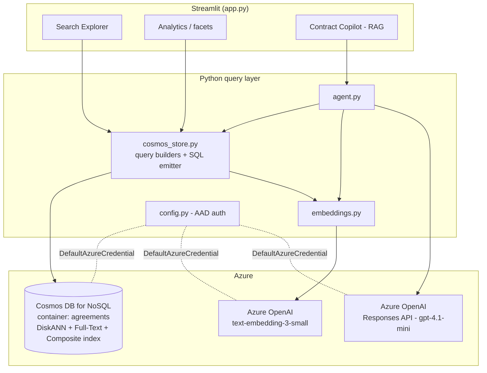

# Architecture

## Overview

The POC is a thin Streamlit front-end over a small Python query layer that talks to a
**real Azure Cosmos DB for NoSQL** container. All search ranking (lexical, vector, hybrid)
and aggregation happens **inside Cosmos DB**; the application only builds queries, embeds
text with Azure OpenAI, and renders results.



## Data model

Each document is an *agreement / envelope*:

```jsonc
{
  "id": "agr-0001",
  "accountId": "acct-northwind",         // partition key
  "accountName": "Northwind Traders",
  "title": "Master Services Agreement – Northwind Cloud Platform",
  "type": "MSA",                          // NDA | MSA | SOW | OrderForm | DPA | Lease | ...
  "status": "completed",                  // sent | delivered | completed | declined | voided
  "createdDate": "2024-03-11",
  "lastUpdated": "2026-02-18",
  "expirationDate": "2027-03-10",
  "folderType": "Completed",
  "sender": "legal@northwind.com",
  "recipients": ["procurement@contoso.com"],
  "tags": ["cloud", "renewal", "saas"],
  "content": "This Master Services Agreement governs ...",   // full-text indexed
  "clauses": [                                               // nested array
    { "clauseType": "Service Level", "text": "99.9% monthly uptime ..." },
    { "clauseType": "Auto-Renewal", "text": "... at least 60 days ..." }
  ],
  "customAttributes": [                                      // nested array
    { "name": "Contract Value", "value": "$480,000" }
  ],
  "contentVector": [ /* 1536 floats from text-embedding-3-small */ ]
}
```

`embedding_text()` composes `title + content + clause text + attributes` and that string is
embedded into `contentVector`.

## Container configuration

Created via `provision/create_container.sh` with three policies:

**Vector embedding policy** (`provision/vec.json`)
```json
{ "vectorEmbeddings": [
  { "path": "/contentVector", "dataType": "float32", "dimensions": 1536, "distanceFunction": "cosine" } ] }
```

**Full-text policy** (`provision/ft.json`)
```json
{ "defaultLanguage": "en-US",
  "fullTextPaths": [ { "path": "/content", "language": "en-US" }, { "path": "/title", "language": "en-US" } ] }
```

**Indexing policy** (`provision/idx.json`) — DiskANN vector index, full-text indexes, and a
composite index for `ORDER BY`:
```json
{
  "indexingMode": "consistent",
  "includedPaths": [{ "path": "/*" }],
  "excludedPaths": [{ "path": "/contentVector/*" }],
  "vectorIndexes":   [{ "path": "/contentVector", "type": "diskANN" }],
  "fullTextIndexes": [{ "path": "/content" }, { "path": "/title" }],
  "compositeIndexes": [[ { "path": "/accountId", "order": "ascending" },
                         { "path": "/lastUpdated", "order": "descending" } ]]
}
```

The container partition key is `/accountId`.

## Query patterns (what `cosmos_store.py` emits)

**Full-text (BM25)** — keyword/phrase relevance, combinable with range filters:
```sql
SELECT TOP 8 c.id, c.title, ...
FROM c
WHERE c.lastUpdated >= @updated_from
ORDER BY RANK FullTextScore(c.content, 'aws', 'renewal')
```

**Vector (semantic)** — nearest neighbours over the DiskANN index:
```sql
SELECT TOP 8 c.id, c.title, ..., VectorDistance(c.contentVector, @q) AS _distance
FROM c
ORDER BY VectorDistance(c.contentVector, @q)
```

**Hybrid (RRF)** — Reciprocal Rank Fusion of vector + BM25 in one ranked list:
```sql
SELECT TOP 8 c.id, c.title, ...
FROM c
ORDER BY RANK RRF(VectorDistance(c.contentVector, @q),
                  FullTextScore(c.content, 'uptime', 'availability', 'sla'))
```

**Nested clause (EXISTS over an array):**
```sql
SELECT TOP 8 ... FROM c
WHERE EXISTS (SELECT VALUE x FROM x IN c.clauses
              WHERE x.clauseType = @clause_type AND CONTAINS(x.text, @clause_contains, true))
ORDER BY c.lastUpdated DESC
```

**Prefix / typeahead:** `WHERE STARTSWITH(c.title, @prefix, true)`

**Faceted aggregation (GROUP BY):**
```sql
SELECT c.type AS key, COUNT(1) AS count FROM c GROUP BY c.type
```
Date histogram via `GROUP BY LEFT(c.lastUpdated, 7)`; cardinality via
`SELECT VALUE COUNT(1) FROM (SELECT DISTINCT VALUE c.type FROM c)`.

## RAG flow (`agent.py`)

1. Embed the natural-language question with `text-embedding-3-small`.
2. Retrieve top-k agreements with **hybrid (RRF)** search from Cosmos DB.
3. Build a compact context block (id, title, status, dates, clauses, attributes).
4. Call the **Azure OpenAI Responses API** (`gpt-4.1-mini`) with a system prompt that
   forces grounding and citation by agreement id/title.
5. Return the answer plus the retrieved set and the SQL used.

## Authentication

`config.py` builds clients with `DefaultAzureCredential` (works after `az login`). For
Cosmos DB the identity needs **Cosmos DB Built-in Data Contributor** (data plane); database
and container **creation** is a control-plane action done once via `az` in
`provision/create_container.sh`. Key-based auth is supported by setting `COSMOS_KEY` /
`AZURE_OPENAI_API_KEY`.
