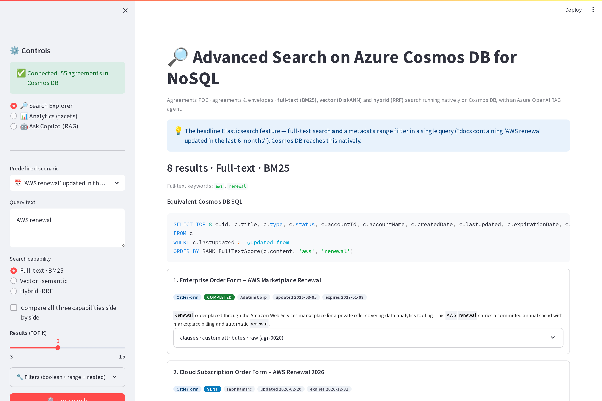
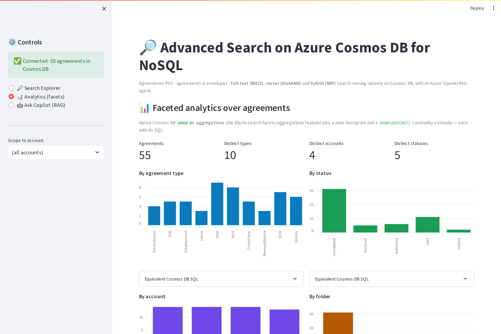
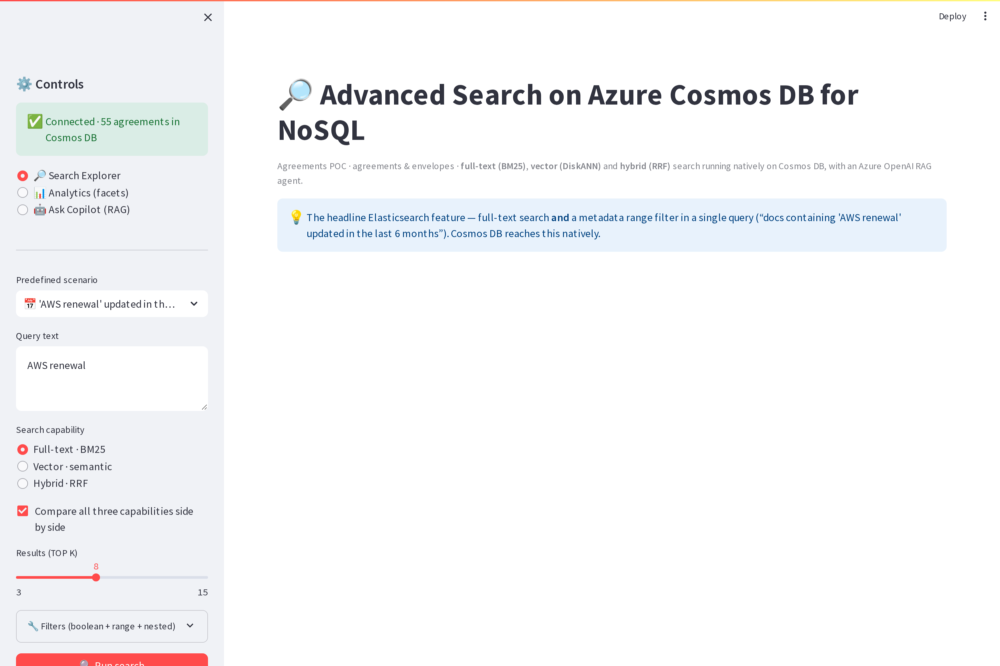
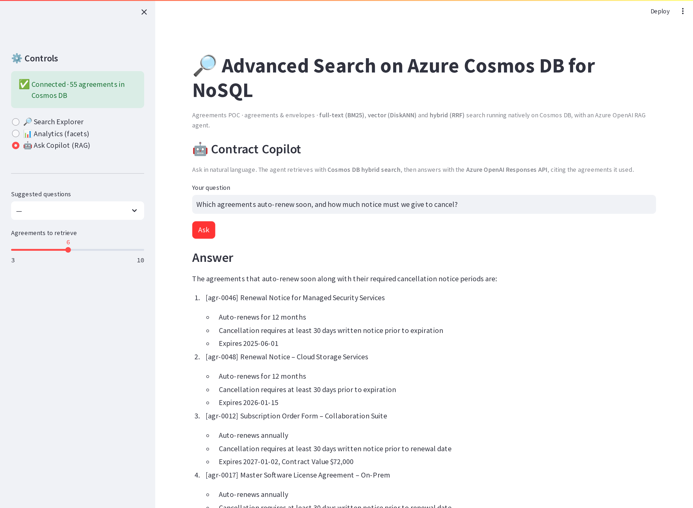
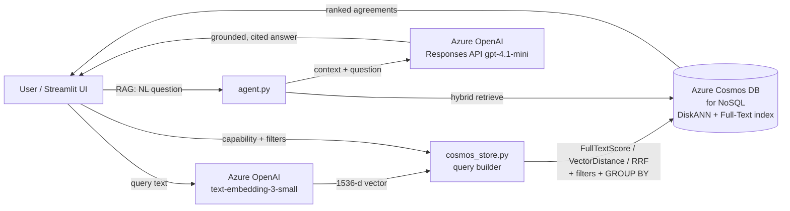

# Advanced Search on Azure Cosmos DB for NoSQL — Agreements Search POC

An interactive proof-of-concept that runs **native search in Azure Cosmos DB for NoSQL**
over a contract-management corpus of **agreements / envelopes**. It demonstrates the search
capabilities a search platform needs *today* **and** the AI-native differentiators
(vector + hybrid search, RAG) that go beyond a legacy Elasticsearch deployment — all on a
single operational database, with **no separate search service**.

> Built to evaluate functional parity (and upside) of Cosmos DB search vs. a legacy
> Elasticsearch platform. Everything below runs against a **real Cosmos DB account** and a
> real **Azure OpenAI `text-embedding-3-small`** deployment.



---

## Capabilities demonstrated

| Capability | What it shows | Cosmos DB feature used |
|---|---|---|
| 🔤 **Full-text search (BM25)** | Keyword/phrase relevance ranking | `ORDER BY RANK FullTextScore(c.content, …)` |
| 🧠 **Vector / semantic search** | Find by *meaning* (NDAs without the word "NDA") | `VectorDistance(c.contentVector, @q)` over a **DiskANN** index |
| 🔀 **Hybrid search** | Best of lexical + semantic, fused | `ORDER BY RANK RRF(VectorDistance(…), FullTextScore(…))` |
| 🧩 **Boolean + range filters** | "text + range in one query" (the headline ES feature) | `WHERE c.status = … AND c.expirationDate >= …` |
| 🪆 **Nested clause / attribute queries** | Match inside `clauses[]` / `customAttributes[]` | `EXISTS (SELECT VALUE x FROM x IN c.clauses WHERE …)` |
| ⌨️ **Typeahead / prefix** | Search-as-you-type on titles | `STARTSWITH(c.title, @prefix, true)` |
| 📊 **Faceted aggregations** | Counts by type/status/account + date histogram + cardinality | `GROUP BY`, `COUNT(1)`, `LEFT(date,7)`, `COUNT(DISTINCT)` pattern |
| ✨ **Highlighting** | Snippets with matched terms emphasised | application-layer (recommended pattern) |
| 🤖 **RAG agent** | NL question → grounded, cited answer | hybrid retrieval → **Azure OpenAI Responses API** |

Every search in the UI also prints the **equivalent Cosmos DB SQL** it executed.

---

## Screens

| Search Explorer (with equivalent SQL) | Faceted Analytics (GROUP BY) |
|---|---|
|  |  |

| Compare all three capabilities | Contract Copilot (RAG) |
|---|---|
|  |  |

---

## Architecture



* **System of record *and* search** live in the same Cosmos DB container — no sync pipeline,
  no separate search cluster to operate.
* **Auth is Azure AD** end-to-end (`DefaultAzureCredential`); no keys in code.

See [`ARCHITECTURE.md`](ARCHITECTURE.md) for the data model, indexing policy, and the exact
query patterns. See [`WALKTHROUGH.md`](WALKTHROUGH.md) for a guided demo script.

---

## Prerequisites

* **Python 3.9+**
* **Azure CLI logged in**: `az login`. The app authenticates to **both** Cosmos DB and Azure
  OpenAI with your identity. You need:
  * **Cosmos DB Built-in Data Contributor** on the target account (data plane), and
  * access to the Azure OpenAI endpoint (Cognitive Services user).
* An **Azure Cosmos DB for NoSQL** account with the capabilities
  `EnableNoSQLVectorSearch` and `EnableNoSQLFullTextSearch`.
* An **Azure OpenAI** resource with `text-embedding-3-small` and a chat deployment
  (e.g. `gpt-4.1-mini`).

## Setup & run

```bash
cd cosmos-search-poc
pip install -r requirements.txt

cp .env.example .env          # then edit .env with your resource names
az login                      # authenticate (AAD)

# 1) (first time only) provision the database + container with the search indexes
COSMOS_ACCOUNT=<account> COSMOS_RG=<resource-group> ./provision/create_container.sh

# 2) load sample agreements + embeddings into Cosmos DB (idempotent)
python build_index.py

# 3) launch the UI
streamlit run app.py          # or ./run.sh  → http://localhost:8501
```

### Optional: generate more sample data with an LLM
```bash
python generate_data.py --count 25 --seed 7   # writes data/generated_agreements.json
python build_index.py                          # merges curated + generated, re-embeds
```

---

## Project layout

| Path | Purpose |
|---|---|
| `config.py` | Env-driven settings, AAD auth, Cosmos/OpenAI client factories |
| `data_gen.py` | Curated agreement-domain sample data + predefined demo queries |
| `generate_data.py` | LLM sample-data generator (Azure OpenAI → validated JSON) |
| `embeddings.py` | Azure OpenAI `text-embedding-3-small` client |
| `cosmos_store.py` | Query builders: FTS / vector / hybrid / filters / nested + GROUP BY + SQL emitter |
| `agent.py` | RAG agent (hybrid retrieval + Responses API) |
| `build_index.py` | Embed + upsert the corpus into Cosmos DB |
| `app.py` | Streamlit UI (Search Explorer · Analytics · Copilot) |
| `provision/` | `az` script + the exact vector/full-text/index policy JSON |
| `tools/capture_screenshots.py` | Regenerate the docs screenshots (Playwright) |
| `ARCHITECTURE.md`, `WALKTHROUGH.md` | Deep dive + guided demo |

---

## How this maps to the Elasticsearch feature inventory

| Legacy Elasticsearch need | Demonstrated here |
|---|---|
| Text + range filters in one query | Scenario 1 (AWS renewal, last 6 months) |
| Complex boolean filters | Scenario 4 (completed MSAs, account, expiry range) |
| Nested document queries | Scenario 5 (auto-renewal clause, 60-day notice) |
| Typeahead / `search_as_you_type` | Scenario 7 (title prefix) |
| Facets / aggregations | Analytics panel (GROUP BY, histogram, cardinality) |
| Highlights | App-layer snippet highlighting on every result |
| **Semantic search (beyond ES keyword)** | Scenarios 2 & 6 (vector) |
| **Hybrid lexical + semantic (RRF)** | Scenarios 3 & 8 (hybrid) |
| **RAG / GenAI on operational data** | Contract Copilot tab |

---

## Notes & limitations

* Cosmos DB full-text search is **GA**; **multi-language** and **fuzzy** matching are in
  **preview**. `FullTextScore` is usable only in `ORDER BY RANK` and cannot be projected, so
  result cards rank by position and **highlighting is done in the app layer** (the
  recommended pattern).
* `GROUP BY` with non-`VALUE` aggregates is executed by Cosmos DB per physical partition;
  the Python SDK supports this for single-partition queries, so the Analytics panel runs the
  real `GROUP BY` once per partition-key value and merges — exactly how the engine fans out.
* `COUNT(DISTINCT)` is not a native single-query function; the cardinality metrics use the
  documented `SELECT VALUE COUNT(1) FROM (SELECT DISTINCT VALUE c.field FROM c)` pattern.
* The sample data is **synthetic and fictional**. Swap in your own by editing `data_gen.py`
  (or `generate_data.py`) and re-running `build_index.py`.

## Security

* No credentials are committed. `.env` is gitignored; auth uses Azure AD by default.
* The repo contains no Azure account names or endpoints — set them in your own `.env`.
